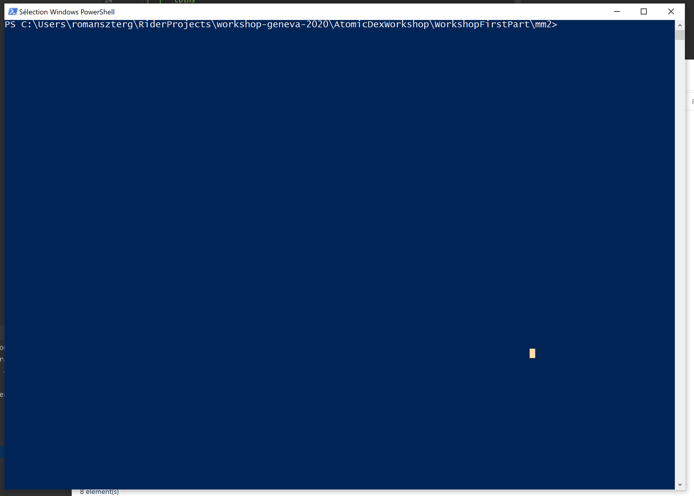

# Workshop part 1

For the first part of this workshop, it is simply a matter of properly configuring your project using the `dotnet` command line

Configure a basic project following this tutorial: https://code.visualstudio.com/docs/languages/dotnet

## AtomicDex / MM2

- Please download the latest mm2 archive at this link: http://195.201.0.6/mm2/mm2-latest-Windows_NT.zip
- Unzip the folder
- Create a powershell script next to the mm2 executable (i named it launch.ps1) with the following content

```pwsh
 .\mm2.exe '{\"gui\": \"MM2GUI\", \"netid\":9999,\"passphrase\":\"Geneva2020Seed\",\"rpc_password\":\"your_passphrase_here\"}'
```

As shown here: https://developers.komodoplatform.com/basic-docs/atomicdex/atomicdex-tutorials/atomicdex-walkthrough.html#initiate-marketmaker-2-0 choose a password and a seed and replace it in your own script, remember the password.

- put the list of coins (file at the root of the repository) next to the mm2 executable.

You should have the following tree:

```                
.
├── mm2
│  ├── coins
│  ├── launch.ps1
│  ├── mm2-latest-Windows_NT.zip
│  ├── mm2.exe
│  ├── msvcp140.dll
│  ├── msvcr100.dll
│  ├── pthreadVC2.dll
│  └── vcruntime140.dll
├── Program.cs
├── README.md
└── WorkshopFirstPart.csproj
```

`dotnet build` and `dotnet run` should work, the last command should produce the following output:

```
PS C:\Users\romanszterg\RiderProjects\workshop-geneva-2020\AtomicDexWorkshop\WorkshopFirstPart> dotnet run
Hello World!
```

And now we are going to launch mm2, to do this we open the file explorer and launch powershell in the mm2 folder:




And then in the powershell console simply type:

```
./launch.ps1
```

You should have the following output:

```
PS C:\Users\romanszterg\RiderProjects\workshop-geneva-2020\AtomicDexWorkshop\WorkshopFirstPart\mm2> .\launch.ps1
22 20:36:51, mm2:166] AtomicDEX MarketMaker 2.0.1599_mm2_c9ebeb177_Windows_NT
22 20:36:51, lp_native_dex:1199] version: 2.0.1599_mm2_c9ebeb177_Windows_NT
22 20:36:51, lp_native_dex:1257] lp_init] Trying to fetch the real IP from 'http://checkip.amazonaws.com/' ...
22 20:36:51, lp_native_dex:1165] test_ip] Trying to listen on 86.247.195.152:15175
22 20:36:51, lp_native_dex:1165] test_ip] Trying to listen on 86.247.195.152:51298
22 20:36:51, lp_native_dex:1165] test_ip] Trying to listen on 86.247.195.152:2859
22 20:36:51, lp_native_dex:1165] test_ip] Trying to listen on 86.247.195.152:65446
22 20:36:51, lp_native_dex:1165] test_ip] Trying to listen on 86.247.195.152:43764
22 20:36:51, lp_native_dex:1165] test_ip] Trying to listen on 86.247.195.152:62104
22 20:36:51, lp_native_dex:1165] test_ip] Trying to listen on 86.247.195.152:46327
22 20:36:51, lp_native_dex:1165] test_ip] Trying to listen on 86.247.195.152:17349
22 20:36:51, lp_native_dex:1165] test_ip] Trying to listen on 86.247.195.152:35879
22 20:36:51, lp_native_dex:1295] IP 86.247.195.152 doesn't check: lp_native_dex:1169] http_fallback:300] error creating server listener: L’adresse demandée n’est pas valide dans son contexte. (os error 10049)
22 20:36:51, lp_native_dex:1165] test_ip] Trying to listen on 0.0.0.0:15175
22 20:36:51, lp_native_dex:1182] test_ip] Checking http://127.0.0.1:15175/test_ip
�😅 2020-01-22 21:36:51 +0100 [myipaddr] We couldn't bind on the external IP 86.247.195.152, so NAT is likely to be present. We'll be okay though.
22 20:36:51, peers:1396] initialize] netid 9999 public key 1586a98c734419df4eab3d0f5ee36410738a0ff2c217a08bade9224af245536f preferred port 47773 drill false
22 20:36:51, rpc:387] >>>>>>>>>> DEX stats 127.0.0.1:7783 DEX stats API enabled at unixtime.1579725411 <<<<<<<<<
… 2020-01-22 21:36:51 +0100 [seed_connection 195.201.116.176:47772] Connecting…
⚡ 2020-01-22 21:36:51 +0100 [seed_connection 195.201.116.176:47772] Connected
… 2020-01-22 21:36:51 +0100 [seed_connection 46.4.87.18:47772] Connecting…    
⚡ 2020-01-22 21:36:51 +0100 [seed_connection 46.4.87.18:47772] Connected 
… 2020-01-22 21:36:51 +0100 [seed_connection 46.4.78.11:47772] Connecting…
⚡ 2020-01-22 21:36:51 +0100 [seed_connection 46.4.78.11:47772] Connected
22 20:36:52, peers:1174] external_ip_alert: 86.247.195.152
+--- 22 20:36:52 -------
| (0:00) [dht-boot] DHT bootstrap ...
```

That's over for the first part !


